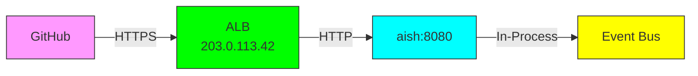
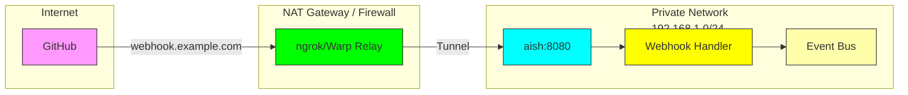
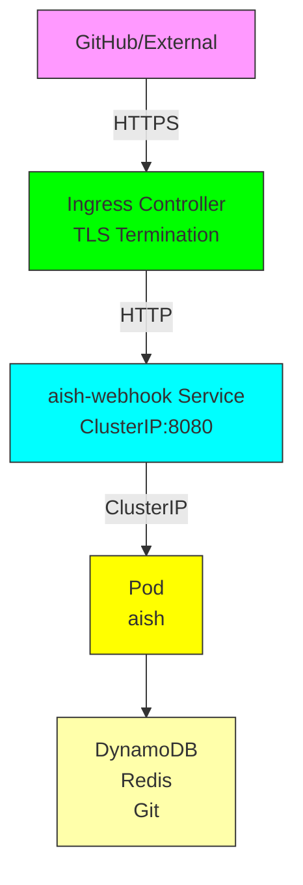
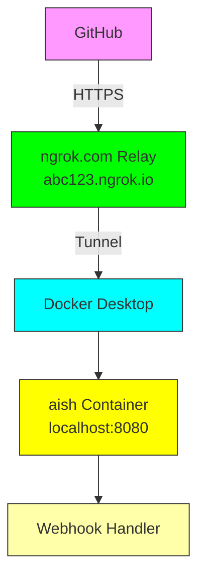
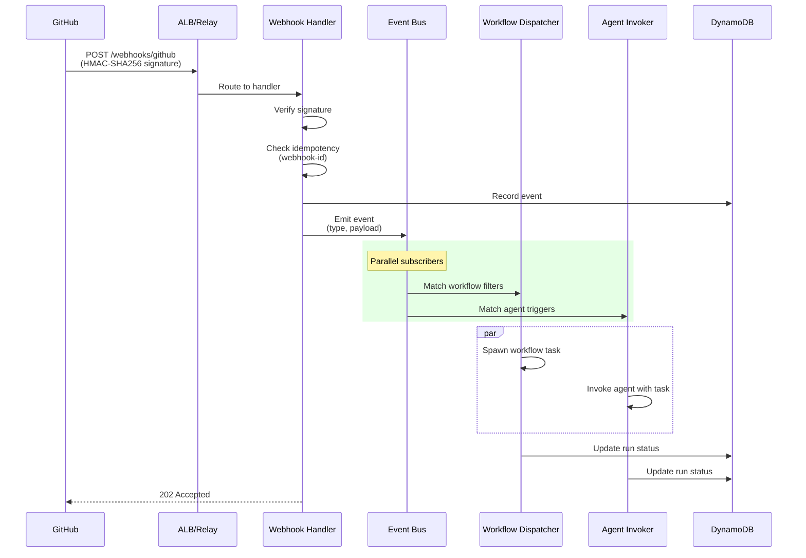
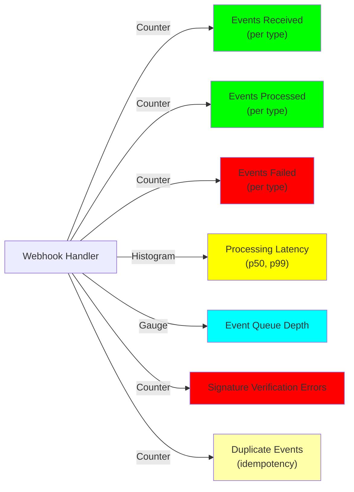

# Webhook Architecture

aish supports receiving events from external sources (GitHub, AWS EventBridge, Slack, CI/CD platforms) and routing them to workflows, agents, and integrations. The webhook layer is designed to handle both public cloud and NAT'd/private network environments.

## High-Level Architecture

```mermaid
graph TB
    subgraph Sources["External Event Sources"]
        GH["GitHub<br/>push, PR, release, workflow_run"]
        EB["AWS EventBridge"]
        Slack["Slack<br/>slash commands, events"]
        Generic["Generic Webhooks"]
        CI["CI/CD Platforms<br/>GitLab, Gitea, Woodpecker"]
    end

    subgraph Ingress["Public Ingress Layer<br/>(Cloud/CDN)"]
        ALB["ALB / API Gateway<br/>TLS Termination<br/>Signature Verification<br/>Rate Limiting"]
    end

    subgraph Server["aish Webhook Server"]
        WH["Webhook Handler :8080/:443<br/>Route Parsing<br/>Signature Validation<br/>Payload Decompression<br/>Idempotency Tracking"]
    end

    subgraph NAT["NAT & Private Network Layer<br/>(when direct is unreachable)"]
        Tunnel["Reverse Tunnel<br/>ngrok / Cloudflare Warp<br/>Persistent Outbound Connection<br/>Auto-Reconnect"]
    end

    subgraph EventBus["Webhook Event Bus<br/>(In-Process)"]
        Queue["Event Queue<br/>tokio::sync::broadcast<br/>Backpressure & Retry<br/>Dead-Letter Queue"]
    end

    subgraph Consumers["Event Consumers"]
        WF["Workflow Dispatch<br/>Sprint Manager<br/>a02 Config"]
        Agent["Agent Invocation<br/>a40, a92<br/>Custom Agents"]
        Callback["Integration Callbacks<br/>Slack, GitHub<br/>Discord, Webhooks"]
    end

    subgraph Runtime["Orchestration Runtime<br/>(tokio)"]
        Exec["Task Spawning<br/>Concurrent Execution<br/>Timeout & Cancellation<br/>Error Recovery"]
    end

    subgraph Store["State Persistence"]
        DDB["DynamoDB<br/>Events, Runs"]
        Redis["Redis<br/>Session Cache"]
        Local["Local Filesystem<br/>Dev"]
    end

    Sources -->|HTTPS| Ingress
    Ingress -->|HTTP/JSON| Server
    Ingress -->|Tunnel Fallback| NAT
    Server -->|IPC/gRPC| Queue
    NAT -->|Tunnel| Server
    Queue --> Consumers
    Consumers --> Runtime
    Runtime --> Store
```



## NAT Traversal Scenarios

### Scenario 1: Public Cloud (Static IP)



**Benefits:**
- ✅ Direct inbound allowed
- ✅ No tunnel overhead
- ✅ Lowest latency

### Scenario 2: NAT'd Office/Home Network



**Key Points:**
- Persistent outbound tunnel (no inbound firewall rules needed)
- Public relay maps external requests to private instance
- Auto-reconnect on network change
- Keepalive + heartbeats prevent idle timeouts

### Scenario 3: Kubernetes with Ingress



### Scenario 4: Docker Desktop with ngrok



## Event Flow



## Security & Reliability Features

### Inbound (Events → aish)

| Feature | Implementation |
|---------|-----------------|
| **Protocol** | HTTPS (TLS 1.3) with certificate pinning (optional) |
| **Signature Verification** | HMAC-SHA256 (GitHub, AWS) or custom JWT |
| **Idempotent Delivery** | Dedup on `X-Webhook-ID` / `MessageId` header |
| **Payload Compression** | gzip support with auto-decompression |
| **Rate Limiting** | Token bucket (per source IP / per webhook) |
| **Timeout Protection** | 30s request timeout, 5s socket timeout |

### Event Processing

| Feature | Implementation |
|---------|-----------------|
| **Event Queue** | tokio::sync::broadcast (bounded, N subscribers) |
| **Backpressure** | Slow-subscriber detection + circuit breaker |
| **Retry Logic** | Exponential backoff (1s → 60s, max 3 retries) |
| **Dead-Letter Queue** | Failed events stored for manual inspection |
| **Audit Trail** | All events logged with request ID + trace ID |

### Outbound (aish → External)

| Feature | Implementation |
|---------|-----------------|
| **Protocol** | HTTPS, gRPC over HTTP/2 |
| **Connection Pooling** | Reuse TCP connections for throughput |
| **Keepalive** | TCP keepalive (9min) + app-level heartbeats |
| **Reconnection** | Exponential backoff on connection failure |
| **Circuit Breaker** | Fail fast after 5 consecutive errors |

## Configuration

### Environment Variables

```bash
# Webhook server
WEBHOOK_ADDR=0.0.0.0:8080              # Listen address
WEBHOOK_TLS_CERT=/path/to/cert.pem     # TLS certificate (optional)
WEBHOOK_TLS_KEY=/path/to/key.pem       # TLS private key (optional)
WEBHOOK_SECRET_GITHUB=<hmac-key>       # GitHub webhook secret
WEBHOOK_SECRET_AWS=<api-key>           # AWS EventBridge secret
WEBHOOK_MAX_PAYLOAD_SIZE=10485760      # Max payload: 10MB

# Event queue
EVENT_QUEUE_CAPACITY=10000              # Max events in flight
EVENT_QUEUE_TIMEOUT_SECS=30             # Max time to process event
EVENT_MAX_RETRIES=3                     # Retry attempts on failure

# NAT/Tunnel (if applicable)
TUNNEL_PROVIDER=ngrok|warp|custom       # Reverse tunnel backend
TUNNEL_TOKEN=<auth-token>               # Tunnel credentials
TUNNEL_URL=https://abc123.ngrok.io     # Public URL for webhook registration
TUNNEL_KEEPALIVE_INTERVAL_SECS=30       # Tunnel heartbeat interval

# State persistence
DYNAMODB_EVENTS_TABLE=aish_events       # DynamoDB table for event log
DYNAMODB_RUNS_TABLE=aish_runs           # DynamoDB table for run records
REDIS_URL=redis://localhost:6379        # Redis session cache
```

## Deployment Checklist

### Public Cloud (AWS/GCP/Azure)

- [ ] ALB or API Gateway configured
- [ ] TLS certificate provisioned (ACM)
- [ ] Security group allows :443 inbound from GitHub/AWS/etc.
- [ ] aish service listening on `0.0.0.0:8080` (or :443 with redirect)
- [ ] Webhook secrets stored in AWS Secrets Manager
- [ ] CloudWatch logs configured for webhook handler
- [ ] Alarms set on error rate (>1% errors/5min)
- [ ] DynamoDB tables created with auto-scaling
- [ ] Redis cluster provisioned (or use ElastiCache)

### NAT'd Environment (ngrok/Cloudflare Warp)

- [ ] Tunnel daemon installed (systemd service)
- [ ] Public URL registered in webhook sources (GitHub, EventBridge, etc.)
- [ ] aish service listening on `localhost:8080`
- [ ] Tunnel client auto-starts on boot
- [ ] Reconnection monitoring + alerting
- [ ] Graceful shutdown sequence (drain events before disconnect)
- [ ] Backup public IP failover (if available)

### Kubernetes

- [ ] Ingress resource created (`cert-manager` for TLS)
- [ ] aish Deployment + Service (`ClusterIP:8080`)
- [ ] NetworkPolicy allows ingress from external sources
- [ ] Pod disruption budgets (min 1 replica always available)
- [ ] Readiness probe: `GET /healthz` → 200
- [ ] Liveness probe: `GET /alive` → 200
- [ ] HPA configured (scale 2-10 replicas on request rate)
- [ ] DynamoDB IAM role attached to pod service account
- [ ] Redis accessible from pod network

## Monitoring & Observability

### Key Metrics



### Log Queries (CloudWatch)

```
# Error rate
fields @timestamp, @message, error
| filter error like /true/
| stats count() as errors by error
| stats sum(errors) / sum(count()) as error_rate

# Slow handlers (>5s)
fields @timestamp, handler, duration_ms
| filter duration_ms > 5000
| stats avg(duration_ms), max(duration_ms) by handler

# Signature verification failures
fields @timestamp, source, event_type
| filter @message like /signature.*failed/
| stats count() by source
```

### Alerting

| Alert | Threshold | Action |
|-------|-----------|--------|
| Error Rate | >1% errors/5min | Page on-call |
| Queue Depth | >1000 events | Scale webhooks or pause consumption |
| Processing Latency | p99 >10s | Investigate handler performance |
| Signature Failures | >10/hour | Check webhook secrets, verify sources |
| Tunnel Disconnection | Any | Alert ops, check connectivity |
| DynamoDB Throttle | Any | Increase throughput or buffer locally |

## Related Docs

- [Event Routing & Filtering](./event-routing.md)
- [Agent Invocation Patterns](./agents.md)
- [Workflow Dispatch](./workflows.md)
- [Setup: ngrok / Cloudflare Warp](./setup/nat-traversal.md)
- [aish Architecture](./architecture.md)
