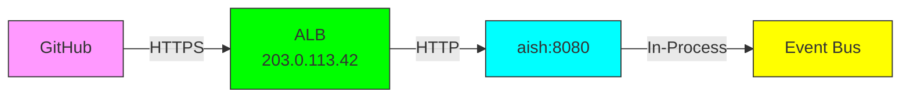
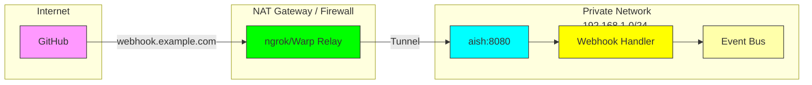
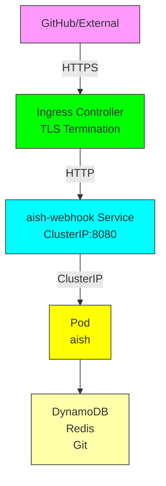
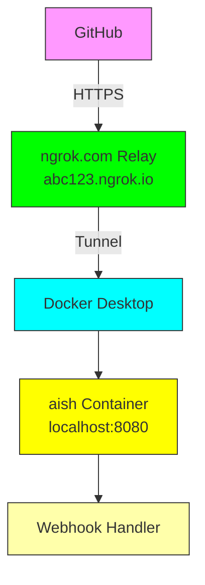
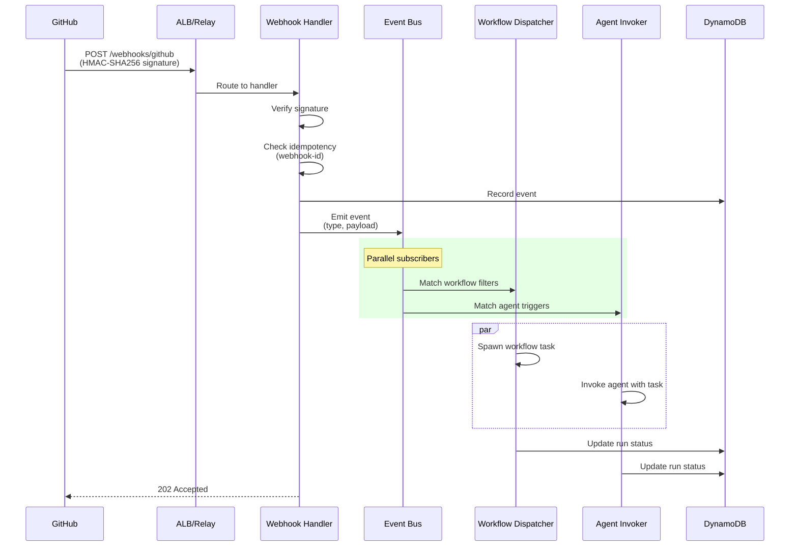

# Webhook Architecture

aish supports receiving events from external sources (GitHub, AWS EventBridge, Slack, CI/CD platforms) and routing them to workflows, agents, and integrations. The webhook layer is designed to handle both public cloud and NAT'd/private network environments.

## High-Level Architecture


```mermaid
graph TB
    subgraph Sources["External Event Sources"]
        GH["GitHub<br/>push, PR, release, workflow_run"]
        EB["AWS EventBridge"]
        Slack["Slack<br/>slash commands, events"]
        Generic["Generic Webhooks"]
        CI["CI/CD Platforms<br/>GitLab, Gitea, Woodpecker"]
    end

    subgraph Ingress["Public Ingress Layer<br/>(Cloud/CDN)"]
        ALB["ALB / API Gateway<br/>TLS Termination<br/>Signature Verification<br/>Rate Limiting"]
    end

    subgraph Server["aish Webhook Server"]
        WH["Webhook Handler :8080/:443<br/>Route Parsing<br/>Signature Validation<br/>Payload Decompression<br/>Idempotency Tracking"]
    end

    subgraph NAT["NAT & Private Network Layer<br/>(when direct is unreachable)"]
        Tunnel["Reverse Tunnel<br/>ngrok / Cloudflare Warp<br/>Persistent Outbound Connection<br/>Auto-Reconnect"]
    end

    subgraph EventBus["Webhook Event Bus<br/>(In-Process)"]
        Queue["Event Queue<br/>tokio::sync::broadcast<br/>Backpressure & Retry<br/>Dead-Letter Queue"]
    end

    subgraph Consumers["Event Consumers"]
        WF["Workflow Dispatch<br/>Sprint Manager<br/>a02 Config"]
        Agent["Agent Invocation<br/>a40, a92<br/>Custom Agents"]
        Callback["Integration Callbacks<br/>Slack, GitHub<br/>Discord, Webhooks"]
    end

    subgraph Runtime["Orchestration Runtime<br/>(tokio)"]
        Exec["Task Spawning<br/>Concurrent Execution<br/>Timeout & Cancellation<br/>Error Recovery"]
    end

    subgraph Store["State Persistence"]
        DDB["DynamoDB<br/>Events, Runs"]
        Redis["Redis<br/>Session Cache"]
        Local["Local Filesystem<br/>Dev"]
    end

    Sources -->|HTTPS| Ingress
    Ingress -->|HTTP/JSON| Server
    Ingress -->|Tunnel Fallback| NAT
    Server -->|IPC/gRPC| Queue
    NAT -->|Tunnel| Server
    Queue --> Consumers
    Consumers --> Runtime
    Runtime --> Store
```

## NAT Traversal Scenarios

### Scenario 1: Public Cloud (Static IP)


```mermaid
graph LR
    GitHub["GitHub"]
    ALB["ALB<br/>203.0.113.42"]
    Aish["aish:8080"]
    Events["Event Bus"]

    GitHub -->|HTTPS| ALB
    ALB -->|HTTP| Aish
    Aish -->|In-Process| Events

    style GitHub fill:#f9f,stroke:#333
    style ALB fill:#0f0,stroke:#333
    style Aish fill:#0ff,stroke:#333
    style Events fill:#ff0,stroke:#333
```

**Benefits:**
- ✅ Direct inbound allowed
- ✅ No tunnel overhead
- ✅ Lowest latency

### Scenario 2: NAT'd Office/Home Network


```mermaid
graph LR
    subgraph Internet["Internet"]
        GitHub["GitHub"]
    end
    
    subgraph NAT_GW["NAT Gateway / Firewall"]
        Relay["ngrok/Warp Relay"]
    end
    
    subgraph Private["Private Network<br/>192.168.1.0/24"]
        Aish["aish:8080"]
        Handler["Webhook Handler"]
        Events["Event Bus"]
    end

    GitHub -->|webhook.example.com| Relay
    Relay -->|Tunnel| Aish
    Aish --> Handler
    Handler --> Events

    style GitHub fill:#f9f,stroke:#333
    style Relay fill:#0f0,stroke:#333
    style Aish fill:#0ff,stroke:#333
    style Handler fill:#ff0,stroke:#333
    style Events fill:#ffa,stroke:#333
```

**Key Points:**
- Persistent outbound tunnel (no inbound firewall rules needed)
- Public relay maps external requests to private instance
- Auto-reconnect on network change
- Keepalive + heartbeats prevent idle timeouts

### Scenario 3: Kubernetes with Ingress


```mermaid
graph TB
    GitHub["GitHub/External"]
    Ingress["Ingress Controller<br/>TLS Termination"]
    Service["aish-webhook Service<br/>ClusterIP:8080"]
    Pod["Pod<br/>aish"]
    Store["DynamoDB<br/>Redis<br/>Git"]

    GitHub -->|HTTPS| Ingress
    Ingress -->|HTTP| Service
    Service -->|ClusterIP| Pod
    Pod --> Store

    style GitHub fill:#f9f,stroke:#333
    style Ingress fill:#0f0,stroke:#333
    style Service fill:#0ff,stroke:#333
    style Pod fill:#ff0,stroke:#333
    style Store fill:#ffa,stroke:#333
```

### Scenario 4: Docker Desktop with ngrok


```mermaid
graph TB
    GitHub["GitHub"]
    Ngrok["ngrok.com Relay<br/>abc123.ngrok.io"]
    Docker["Docker Desktop"]
    Container["aish Container<br/>localhost:8080"]
    Handler["Webhook Handler"]

    GitHub -->|HTTPS| Ngrok
    Ngrok -->|Tunnel| Docker
    Docker --> Container
    Container --> Handler

    style GitHub fill:#f9f,stroke:#333
    style Ngrok fill:#0f0,stroke:#333
    style Docker fill:#0ff,stroke:#333
    style Container fill:#ff0,stroke:#333
    style Handler fill:#ffa,stroke:#333
```

## Event Flow


```mermaid
sequenceDiagram
    participant GH as GitHub
    participant ALB as ALB/Relay
    participant WH as Webhook Handler
    participant BUS as Event Bus
    participant WF as Workflow Dispatcher
    participant AGENT as Agent Invoker
    participant STATE as DynamoDB

    GH->>ALB: POST /webhooks/github<br/>(HMAC-SHA256 signature)
    ALB->>WH: Route to handler
    WH->>WH: Verify signature
    WH->>WH: Check idempotency<br/>(webhook-id)
    WH->>STATE: Record event
    WH->>BUS: Emit event<br/>(type, payload)
    
    rect rgba(0, 255, 0, 0.1)
        Note over BUS: Parallel subscribers
        BUS->>WF: Match workflow filters
        BUS->>AGENT: Match agent triggers
    end
    
    par
        WF->>WF: Spawn workflow task
        AGENT->>AGENT: Invoke agent with task
    end
    
    WF->>STATE: Update run status
    AGENT->>STATE: Update run status
    WH-->>GH: 202 Accepted
```

## Security & Reliability Features

### Inbound (Events → aish)

| Feature | Implementation |
|---------|-----------------|
| **Protocol** | HTTPS (TLS 1.3) with certificate pinning (optional) |
| **Signature Verification** | HMAC-SHA256 (GitHub, AWS) or custom JWT |
| **Idempotent Delivery** | Dedup on `X-Webhook-ID` / `MessageId` header |
| **Payload Compression** | gzip support with auto-decompression |
| **Rate Limiting** | Token bucket (per source IP / per webhook) |
| **Timeout Protection** | 30s request timeout, 5s socket timeout |

### Event Processing

| Feature | Implementation |
|---------|-----------------|
| **Event Queue** | tokio::sync::broadcast (bounded, N subscribers) |
| **Backpressure** | Slow-subscriber detection + circuit breaker |
| **Retry Logic** | Exponential backoff (1s → 60s, max 3 retries) |
| **Dead-Letter Queue** | Failed events stored for manual inspection |
| **Audit Trail** | All events logged with request ID + trace ID |

### Outbound (aish → External)

| Feature | Implementation |
|---------|-----------------|
| **Protocol** | HTTPS, gRPC over HTTP/2 |
| **Connection Pooling** | Reuse TCP connections for throughput |
| **Keepalive** | TCP keepalive (9min) + app-level heartbeats |
| **Reconnection** | Exponential backoff on connection failure |
| **Circuit Breaker** | Fail fast after 5 consecutive errors |

## Configuration

### Environment Variables

```bash
# Webhook server
WEBHOOK_ADDR=0.0.0.0:8080              # Listen address
WEBHOOK_TLS_CERT=/path/to/cert.pem     # TLS certificate (optional)
WEBHOOK_TLS_KEY=/path/to/key.pem       # TLS private key (optional)
WEBHOOK_SECRET_GITHUB=<hmac-key>       # GitHub webhook secret
WEBHOOK_SECRET_AWS=<api-key>           # AWS EventBridge secret
WEBHOOK_MAX_PAYLOAD_SIZE=10485760      # Max payload: 10MB

# Event queue
EVENT_QUEUE_CAPACITY=10000              # Max events in flight
EVENT_QUEUE_TIMEOUT_SECS=30             # Max time to process event
EVENT_MAX_RETRIES=3                     # Retry attempts on failure

# NAT/Tunnel (if applicable)
TUNNEL_PROVIDER=ngrok|warp|custom       # Reverse tunnel backend
TUNNEL_TOKEN=<auth-token>               # Tunnel credentials
TUNNEL_URL=https://abc123.ngrok.io     # Public URL for webhook registration
TUNNEL_KEEPALIVE_INTERVAL_SECS=30       # Tunnel heartbeat interval

# State persistence
DYNAMODB_EVENTS_TABLE=aish_events       # DynamoDB table for event log
DYNAMODB_RUNS_TABLE=aish_runs           # DynamoDB table for run records
REDIS_URL=redis://localhost:6379        # Redis session cache
```

## Deployment Checklist

### Public Cloud (AWS/GCP/Azure)

- [ ] ALB or API Gateway configured
- [ ] TLS certificate provisioned (ACM)
- [ ] Security group allows :443 inbound from GitHub/AWS/etc.
- [ ] aish service listening on `0.0.0.0:8080` (or :443 with redirect)
- [ ] Webhook secrets stored in AWS Secrets Manager
- [ ] CloudWatch logs configured for webhook handler
- [ ] Alarms set on error rate (>1% errors/5min)
- [ ] DynamoDB tables created with auto-scaling
- [ ] Redis cluster provisioned (or use ElastiCache)

### NAT'd Environment (ngrok/Cloudflare Warp)

- [ ] Tunnel daemon installed (systemd service)
- [ ] Public URL registered in webhook sources (GitHub, EventBridge, etc.)
- [ ] aish service listening on `localhost:8080`
- [ ] Tunnel client auto-starts on boot
- [ ] Reconnection monitoring + alerting
- [ ] Graceful shutdown sequence (drain events before disconnect)
- [ ] Backup public IP failover (if available)

### Kubernetes

- [ ] Ingress resource created (`cert-manager` for TLS)
- [ ] aish Deployment + Service (`ClusterIP:8080`)
- [ ] NetworkPolicy allows ingress from external sources
- [ ] Pod disruption budgets (min 1 replica always available)
- [ ] Readiness probe: `GET /healthz` → 200
- [ ] Liveness probe: `GET /alive` → 200
- [ ] HPA configured (scale 2-10 replicas on request rate)
- [ ] DynamoDB IAM role attached to pod service account
- [ ] Redis accessible from pod network

## Monitoring & Observability

The webhook broker (`crates/aish-webhook-broker`) uses **SigNoz / OpenTelemetry**
for observability. It does not export Prometheus metrics. Everything below is
implemented today (TASK-314, TASK-375).

### Broker metrics (OTLP)

Set `OTEL_EXPORTER_OTLP_ENDPOINT` (for example `http://otel-collector:4318`) and
the broker pushes OpenTelemetry metrics over OTLP HTTP/protobuf. When it is
unset, the broker builds no exporter, so the default costs nothing. SigNoz Cloud
also needs `OTEL_EXPORTER_OTLP_HEADERS=signoz-ingestion-key=<key>`. The broker
also honours `OTEL_SERVICE_NAME` (default `aish-webhook-broker`) and
`OTEL_METRIC_EXPORT_INTERVAL` (in ms, default 60000).

| Metric | Type | Attributes | Meaning |
|---|---|---|---|
| `aish.webhook.broker.received` | counter | tenant_id, plugin_id | Webhooks accepted (HTTP 202) |
| `aish.webhook.broker.delivered` | counter | + `transport` (ws\|poll) | Envelopes delivered to clients |
| `aish.webhook.broker.dropped` | counter | tenant_id, plugin_id | Undelivered webhooks evicted by the queue cap |
| `aish.webhook.broker.expired` | counter | tenant_id, plugin_id | Undelivered webhooks removed by the TTL sweep |
| `aish.webhook.broker.queued` | gauge | tenant_id, plugin_id | Undelivered webhooks queued now (durable) |
| `aish.webhook.broker.acked` | gauge | tenant_id, plugin_id | Acked webhooks kept until their TTL |

`GET /stats` returns the same numbers as JSON. The metrics never include
payloads, secrets, client ids or tokens. The broker does not record
signature-failure, duplicate-event or delivery-latency histogram metrics yet.
Queue depth works as the latency proxy.

### Dashboard

Import `crates/aish-webhook-broker/deploy/signoz/broker-dashboard.json` into
SigNoz (Dashboards → Import JSON). It shows ingress and delivery rates, losses
(dropped/expired), queue depth and a per-plugin health table. You can filter it
by `tenant_id` and `plugin_id`. See
[`deploy/signoz/README.md`](../crates/aish-webhook-broker/deploy/signoz/README.md).

### Logs

`LOG_FORMAT=json` switches broker logs to one JSON object per line, with
`timestamp`, `level`, `target` and `fields.*`. The SigNoz/OTel collector log
pipelines parse this format directly. `BROKER_LOG_LEVEL` sets the filter. The
default `text` format is meant for humans.

### Client-side handler health

In aish, `:webhook status` shows the handler counters for the connected client:

```
handlers run: 12  ok: 10  failed: 1  timeout: 1  avg: 34ms
plugins: github 7/8 ✗1, slack 3/4 ⏱1
```

The counters are kept per plugin. "dispatched" counts handlers that were
actually executed, so handlers removed by filters are not counted. A timeout is
a handler killed after its `timeout_secs`. `:webhook logs` shows the individual
audit records, each with `duration_ms`.

### Load testing

`crates/aish-webhook-broker/scripts/loadgen.py` sends HMAC-SHA256-signed POSTs
at a fixed rate. It uses only the Python standard library. The run shows up in
`/stats` and on the dashboard.

```sh
python3 crates/aish-webhook-broker/scripts/loadgen.py --url http://localhost:8080 \
  --tenant acme --plugin github --secret s3cret --register --rate 50 --duration 30
```

### Alerting (SigNoz alerts on the metrics above)

| Alert | Condition | Action |
|-------|-----------|--------|
| Data loss (queue cap) | `aish.webhook.broker.dropped` increase > 0 / 5m | Consumer offline: check client connectivity, raise `BROKER_MAX_QUEUE_SIZE` |
| Data loss (TTL) | `aish.webhook.broker.expired` increase > 0 | Webhooks aged out undelivered |
| Backlog | `aish.webhook.broker.queued` > 80% of `BROKER_MAX_QUEUE_SIZE` for 10m | Consumer slow or disconnected |
| Ingress stopped | `aish.webhook.broker.received` rate == 0 for 1h (when traffic is expected) | Check source webhook config / tunnel |

## Related Docs

- [Event Routing & Filtering](./event-routing.md)
- [Agent Invocation Patterns](./agents.md)
- [Workflow Dispatch](./workflows.md)
- [Setup: ngrok / Cloudflare Warp](./setup/nat-traversal.md)
- [aish Architecture](./architecture.md)
