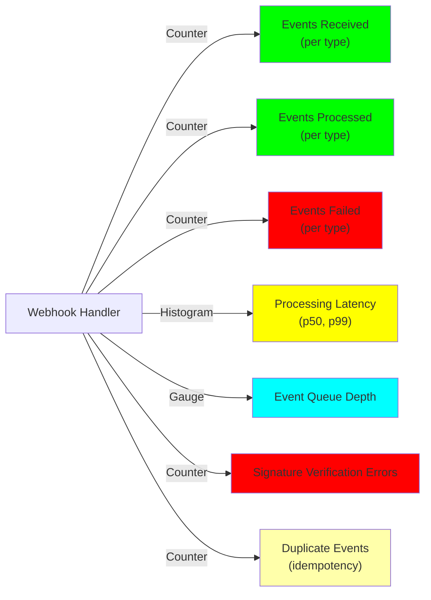

# Webhook Architecture

aish receives events from external sources (GitHub, CI systems, Atum, anything
that can POST JSON) through a small relay — the **webhook broker** — and routes
each event to plugin **handlers** running inside your aish session. aish always
**dials out** to the broker, so it works unchanged behind NAT, on a laptop, or in
a container: no inbound port, tunnel, or public IP on the aish side.

> Writing a handler? See [WEBHOOK_HANDLERS.md](./WEBHOOK_HANDLERS.md).
> Writing a plugin? See [PLUGIN_DEVELOPER.md](./PLUGIN_DEVELOPER.md).
> Running the broker? See the broker crate docs linked under
> [Deployment](#deployment).
>
> The client↔broker protocol described here is the one shipping in SPR-104
> (TASK-449: register → `session_token` auth → `webhook_id` acks).

## High-Level Architecture

```text
 GitHub / CI / any sender
        │  POST /webhooks/<tenant_id>/<plugin_id>     (optional X-Signature HMAC)
        ▼
 ┌──────────────────────────────┐
 │ aish-webhook-broker          │  axum + SQLite (crates/aish-webhook-broker)
 │  • verifies HMAC per route   │  durable queue per (tenant, plugin), TTL 7 d
 │  • queues, delivers, acks    │  GET /health, GET /stats, OTLP metrics
 └──────────────┬───────────────┘
                │  WebSocket (or HTTP long-poll) — opened BY aish
                ▼
 ┌──────────────────────────────┐
 │ aish session                 │  src/webhook.rs + crates/aish-webhook-client
 │  • registers, authenticates  │
 │  • matches plugin webhooks[] │  ~/.aish/plugins/*/plugin.json
 │  • fork/execs handlers       │  payload JSON on stdin, WEBHOOK_* env
 │  • logs deliveries (JSONL)   │  ~/.aish/state/webhooks/<plugin>.jsonl
 └──────────────┬───────────────┘
                ▼
     first stdout line → SecondStatusLine flash
```

Delivery is **at-least-once**: the broker keeps each message in SQLite until the
client acks it (or it ages out after `BROKER_MSG_TTL_SECS`, default 7 days), and
replays the backlog when a client reconnects. Handlers should be idempotent;
the envelope `id` is stable across redeliveries.

## Event Flow

1. A sender POSTs JSON to `https://<broker>/webhooks/<tenant_id>/<plugin_id>`.
   The broker answers `404` if no client has registered that route, `401` if the
   route has a secret and the signature is missing/wrong, else
   `202 {"id": "...", "status": "queued"}`.
2. The event type is taken from the first header present — `X-Event-Type`,
   `X-GitHub-Event`, `X-GitLab-Event` — falling back to `payload.action`, then
   `payload.event`, then `"unknown"`. Set `X-Event-Type` explicitly for
   non-GitHub senders.
3. The broker pushes `{"type":"webhook","id","tenant_id","plugin_id","event_type","payload","received_at"}`
   to the connected client (or holds it for the next poll/reconnect).
4. aish dispatches the event to every handler whose `event_type` and `filters`
   match, records the outcome in the delivery log, and acks with
   `{"type":"ack","webhook_id":"..."}`.

Handler contract, matching rules, and troubleshooting:
[WEBHOOK_HANDLERS.md](./WEBHOOK_HANDLERS.md).

## Security

- **Outbound only.** aish opens the connection; nothing listens on the aish host.
- **Registration + session token.** aish registers at
  `POST /clients/register` and authenticates the WebSocket with the returned
  `session_token`; a bad token gets `auth_error`.
- **Per-route HMAC.** If aish registers with `WEBHOOK_BROKER_SECRET`, the broker
  requires `X-Signature` or `X-Hub-Signature-256` (`sha256=<hex HMAC-SHA256 of
  the raw body>`, constant-time compare) on every inbound webhook for that
  (tenant, plugin). Use the same value as the GitHub webhook secret.
- **No shell.** Handlers are fork/exec'd as argv; payload data only arrives on
  stdin.
- **Redacted logs.** The delivery log masks secret-looking keys (`token`,
  `secret`, `authorization`, `signature`, …) before writing.
- Terminate TLS in front of the broker (Fly, nginx, ALB) — see the broker's
  hardening notes.

## Configuration

### aish (client)

| Variable | Required | Default | Meaning |
|---|---|---|---|
| `WEBHOOK_BROKER_URL` | yes | — | `wss://host/ws` (or `ws://`). Unset → webhooks off, zero cost. |
| `WEBHOOK_PLUGIN_ID` | yes | — | Plugin route this session registers for. Missing → client not started (warning). |
| `WEBHOOK_TENANT_ID` | no | `default` | Tenant route segment. |
| `WEBHOOK_BROKER_SECRET` | no | — | Per-route HMAC secret, sent once at registration. |
| `WEBHOOK_CLIENT_ID` | no | generated | Stable client/session id. |
| `AISH_PLUGINS_DIR` | no | `~/.aish/plugins` | Where handler manifests are loaded from. |
| `AISH_WEBHOOK_AUDIT_MAX` | no | `1000` | Delivery-log records kept per plugin; `0` disables the log. |

### Broker

| Variable | Default | Meaning |
|---|---|---|
| `BROKER_LISTEN` | `0.0.0.0:8080` | Bind address |
| `BROKER_DB` | `/var/lib/aish-broker.db` | SQLite path (Fly: `/data/aish-broker.db` on a volume) |
| `BROKER_MAX_QUEUE_SIZE` | `1000` | Per-(tenant, plugin) queue cap; oldest evicted (counted as `dropped`) |
| `BROKER_WS_HEARTBEAT_SECS` | `30` | WebSocket ping interval |
| `BROKER_POLL_TIMEOUT_SECS` | `60` | Long-poll wait |
| `BROKER_MSG_TTL_SECS` | `604800` | Message TTL (7 days) |
| `BROKER_LOG_LEVEL` | `info` | Log filter |

Full reference: [CONFIGURATION.md](../crates/aish-webhook-broker/docs/CONFIGURATION.md).

## Deployment

The broker is a single static binary with an embedded SQLite file; run one
instance per database.

- Docker, systemd, AWS, nginx, hardening, and Fly.io (persistent volume at
  `/data`): [DEPLOYMENT.md](../crates/aish-webhook-broker/docs/DEPLOYMENT.md)
- HTTP/WebSocket API, `/health`, `/stats`: [API.md](../crates/aish-webhook-broker/docs/API.md)
- Client protocol: [CLIENT.md](../crates/aish-webhook-broker/docs/CLIENT.md)
- Load bench (`tests/load_bench.rs`, ignored by default; `BENCH_N`,
  `BENCH_CONC`, `BENCH_RATE`) — TASK-371

- Metrics: `GET /stats`, plus OTLP metrics and a SigNoz dashboard when
  `OTEL_EXPORTER_OTLP_ENDPOINT` is set — see
  [Monitoring & Observability](#monitoring--observability) (TASK-375)

Hosted `aish.sh` broker: not yet available (TASK-270, deferred).

### Operator checklist

- [ ] Broker reachable over TLS; `GET /health` returns `"status"`.
- [ ] `BROKER_DB` on persistent storage.
- [ ] Each aish session has `WEBHOOK_BROKER_URL` + `WEBHOOK_PLUGIN_ID`
      (+ `WEBHOOK_TENANT_ID`, `WEBHOOK_BROKER_SECRET` if signing).
- [ ] Sender (e.g. GitHub) points at `https://<broker>/webhooks/<tenant>/<plugin>`
      with the same secret.
- [ ] `:webhook status` shows `connected`; `:webhook logs` shows deliveries.

## Monitoring & Observability

### Key Metrics


```mermaid
graph LR
    WH["Webhook Handler"]
    
    WH -->|Counter| Received["Events Received<br/>(per type)"]
    WH -->|Counter| Processed["Events Processed<br/>(per type)"]
    WH -->|Counter| Failed["Events Failed<br/>(per type)"]
    WH -->|Histogram| Latency["Processing Latency<br/>(p50, p99)"]
    WH -->|Gauge| QueueDepth["Event Queue Depth"]
    WH -->|Counter| SigErrors["Signature Verification Errors"]
    WH -->|Counter| DupEvents["Duplicate Events<br/>(idempotency)"]
    
    style Received fill:#0f0
    style Processed fill:#0f0
    style Failed fill:#f00
    style Latency fill:#ff0
    style QueueDepth fill:#0ff
    style SigErrors fill:#f00
    style DupEvents fill:#ffa
```

### Log Queries (CloudWatch)

```
# Error rate
fields @timestamp, @message, error
| filter error like /true/
| stats count() as errors by error
| stats sum(errors) / sum(count()) as error_rate

# Slow handlers (>5s)
fields @timestamp, handler, duration_ms
| filter duration_ms > 5000
| stats avg(duration_ms), max(duration_ms) by handler

# Signature verification failures
fields @timestamp, source, event_type
| filter @message like /signature.*failed/
| stats count() by source
```

### Alerting

| Alert | Threshold | Action |
|-------|-----------|--------|
| Error Rate | >1% errors/5min | Page on-call |
| Queue Depth | >1000 events | Scale webhooks or pause consumption |
| Processing Latency | p99 >10s | Investigate handler performance |
| Signature Failures | >10/hour | Check webhook secrets, verify sources |
| Tunnel Disconnection | Any | Alert ops, check connectivity |
| DynamoDB Throttle | Any | Increase throughput or buffer locally |

## Related Docs

- [WEBHOOK_HANDLERS.md](./WEBHOOK_HANDLERS.md) — handler contract, testing, troubleshooting
- [PLUGIN_DEVELOPER.md](./PLUGIN_DEVELOPER.md) — plugin manifest and lifecycle
- [reference/plugins/webhook-events.md](./reference/plugins/webhook-events.md) — shell lifecycle events (`webhook_url` / `webhook_command`)
- [design/webhook-plugin-routing.md](./design/webhook-plugin-routing.md) — routing design
- [ARCHITECTURE.md](./ARCHITECTURE.md) — aish architecture
